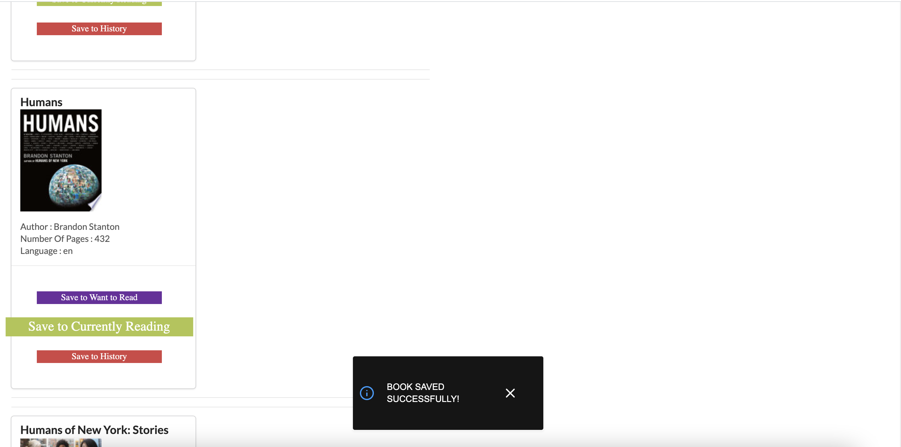
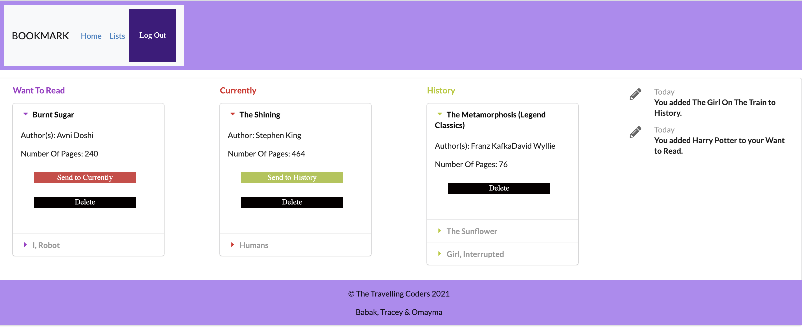

# Bookmark

### What it does:

- Bookmark is a search application that allows users to search and save books.

- Users are able to create an account using their email and keep a digital track of their books.

- Users can find the latest information on books via the news feed.

- Books can be moved to different section depending on their "read" status: Want To Read, Currently Reading & History.

## Technology Used

- React.js / Javascript

- Express

- MongoDB / Atlas

- Mongoose

- Node.js

- Auth0

- Google Books API

- Guardian API

- Semantic UI

- Bootstrap

- Axios

- package.JSON

- gitignore

## Links

- [GitHub repository](https://github.com/Babakbigdeli/BookmarkApp)

- [Heroku Deployed Link](https://digital-bookmark.herokuapp.com/)

- [Babak's GitHub](https://github.com/Babakbigdeli)

- [Tracey's GitHub](https://github.com/traceysaada)

- [Omayma's GitHub](https://github.com/omaymaahmad)

## Screenshot of Application

